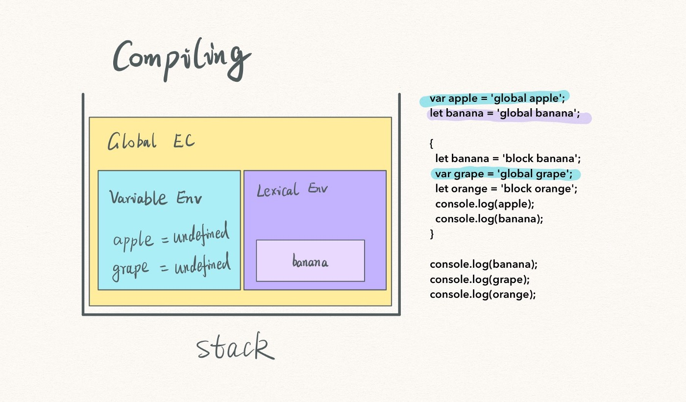
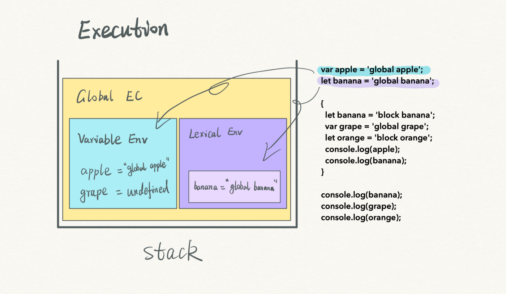
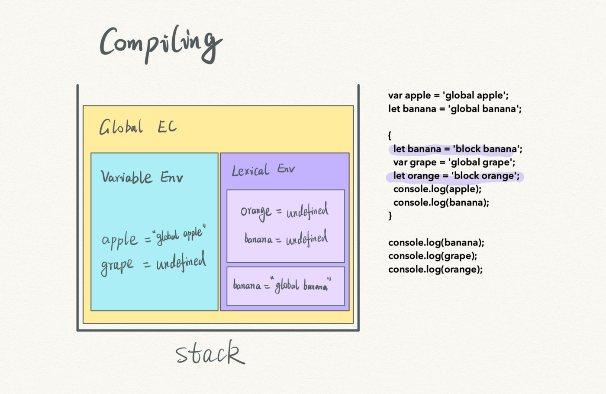
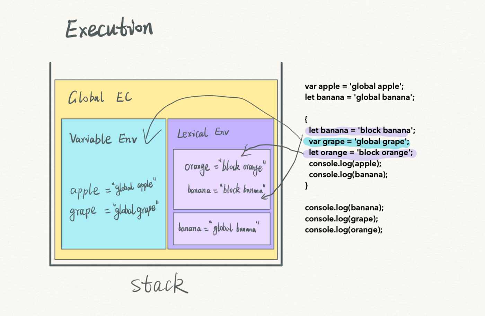
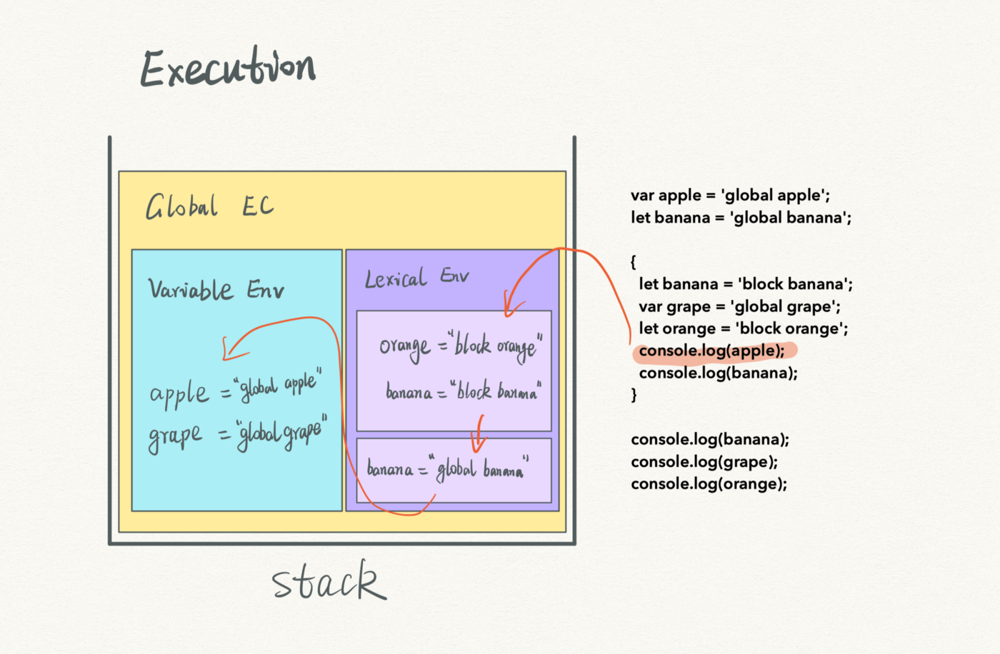
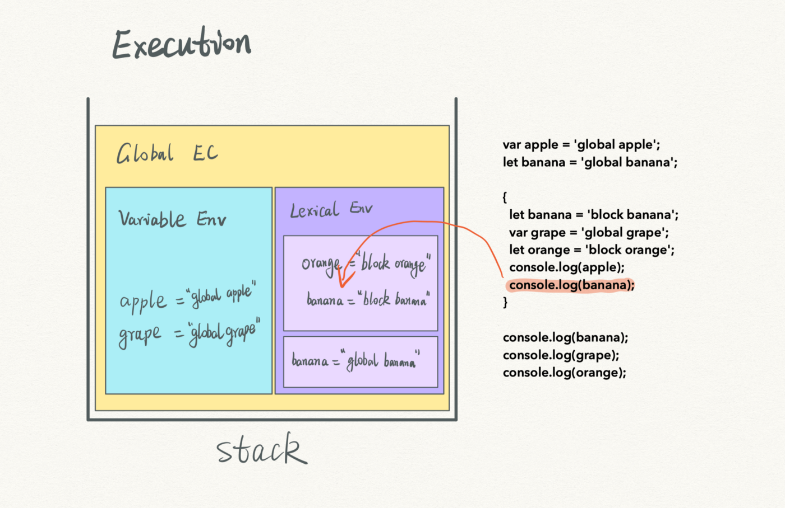
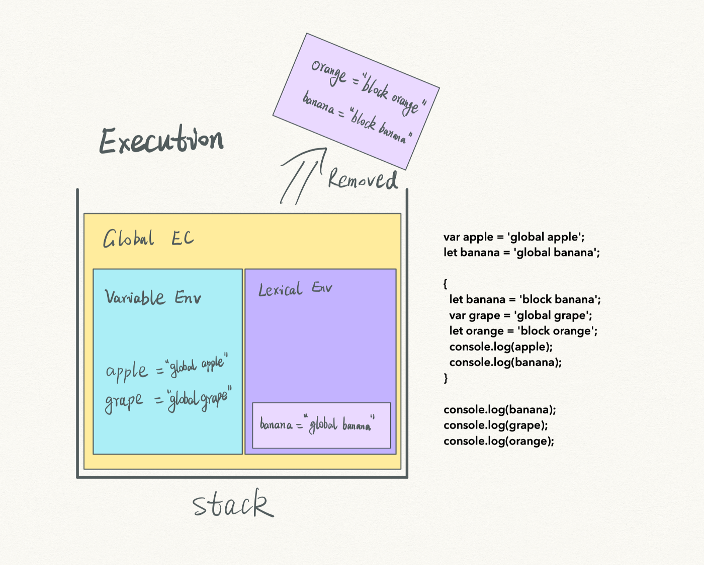
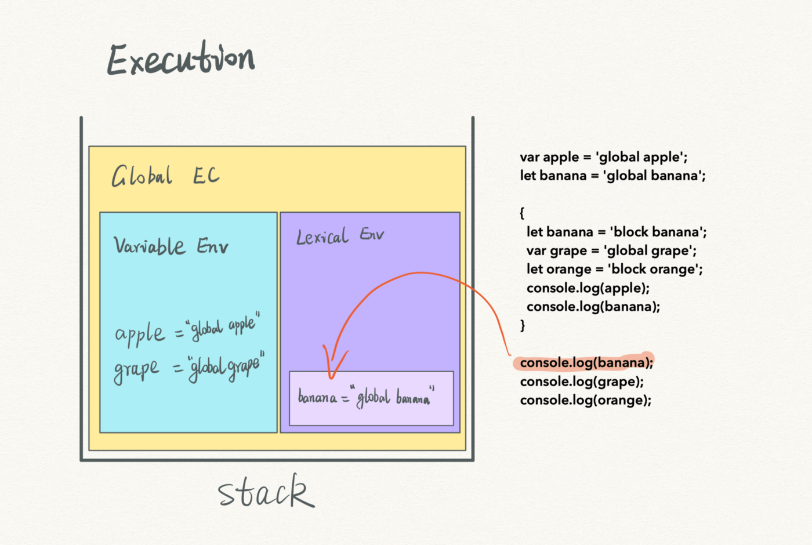
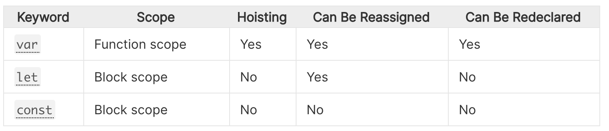

# What is a function ?
- A function is a subprogram designed to perform a particular task.
- Functions are executed when they are called. This is known as invoking a function.
- Values can be passed into functions and used within the function.
- Functions always return a value. In JavaScript, if no return value is specified, the function will return undefined.
- Functions are objects.
# Define a function
1. Function Declaration:
- It defines a named function.
- To create a function declaration you use the function keyword followed by the name of the function.
- When using function declarations, the function definition is hoisted, thus allowing the function to be used before it is defined.
```
function name(parameters){
statements
}
```
2. Function Expression:
- It defines a named or anonymous function. (An anonymous function is a function that has no name)
- Function Expressions are not hoisted, and therefore cannot be used before they are defined
```
let name = function(parameters){
statements
}
```
3. Arrow Function Expression:
- It is a shorter syntax for writing function expressions.
- Arrow functions do not create their own this value.
```
let name = (parameters) => {
statements
}
```
# Parameters vs. Arguments
- Parameters are used when defining a function, they are the names created in the function definition.
- Arguments are the values the function receives from each parameter when the function is executed (invoked).

```
const param1 = true;
const param2 = false;
function twoParams(param1, param2){
console.log(param1, param2);
}
Arguments: true, false;
Parameters: param1, param2
```
# Scope:
There 2 scope in javascript. Function and Block scope.
1. Function Scope(var):
- A variable being declared using var will be function scoped. (other types of blocks — like if-statements, loops etc — will not be considered as a scope.)
- It will exist within the scope of the function it’s declared inside of or if not created inside a function, they are ‘globally scoped.’
```
function myFunc() {
var name = 'Luke'
console.log(name); // 'Luke'
}

myFunc();

console.log(name); // name is not defined
```
2. Block Scope(let and const):
- In ES6, let and const were introduced as alternative ways of declaring variables — both being blocked scoped.
- In block scope, any block will be a scope.(like function, if statements, loops).
Note: A block is a set of opening and closing curly brackets.
```
function myFunc() {
let name = 'Luke'
console.log(name); // 'Luke'
}

myFunc();

console.log(name); // name is not defined
```
# The difference between const and let ?
- `Const` is exactly like `let`, but defines a constant reference for a variable.
- We can't change the value of constant reference
- If we can put a primitive value in a constant, that value will be protected from getting changed
- If the constant is an object, we can still change the properties of that object. (Note: We can't reassign new object to a constant object)
# How many scopes exist in JS ?
JavaScript has three types of scopes since ES6 update:
- Global scope
- Function scope
- Block scope
# What is scope ?
- Scope in JavaScript refers to the current context of code, which determines the accessibility of variables to JavaScript.
- The current context of execution.
- The context in which values and expressions are "visible" or can be referenced.
- If a variable or other expression is not "in the current scope," then it is unavailable for use.
- Scopes can also be layered in a hierarchy, so that child scopes have access to parent scopes, but not vice versa.
- A function serves as a closure in JavaScript, and thus creates a scope, so that (for example) a variable defined exclusively
  within the function cannot be accessed from outside the function or within other functions.
# Example:
```
var apple = 'global apple';
let banana = 'global banana';
if(true) {
let banana = 'block banana';
var grape = 'block grape';
let orange = 'block orange';
console.log(apple);
console.log(banana);
}
console.log(banana);
console.log(grape);
console.log(orange);
```
- At the compiling step, undefined "apple" and "grape" variables are initialized in the variable environment.
- The grape initialization is hoisted. Meanwhile, a banana variable is created in the lexical environment.

- The execution starts. "apple" is assigned with a value “global apple”, while banana gets “global banana”.

- When seeing let and const variables in a block scope, the JavaScript creates a separate area for them.
  The lexical environment maintains a stack-like structure for its variables, so variables with the same name don’t conflict with each other.
- Here, the undefined banana and orange variables sit in a stand-along scope.

- Soon, both are assigned with a value correspondingly.

- When logging the first variable, the JavaScript engine first tries to find the apple in the lexical environment from top to bottom.
  Then it exams the global variable environment and finds the apple, logging out “global apple”.

- When searching for the banana, the JavaScript engine follows the same steps, finds it, and logs “block banana”.

- At this moment, no more executable codes remained in the block. The block scope is removed.

- The script continues execution. It finds the banana and the grape in the global variable environment and logs out “global banana”
  and “global grape” correspondingly.

- When the script searches for the orange, the variable doesn’t exist anywhere, because the scope where orange existed was removed.
  It throws an error “orange is not defined.”
# Tricks of creation, initialization, and assignment
- For a let variable, its creation is hoisted, but not initialization and assignment.
- For a var variable, its creation and initialization are hoisted, but not the assignment.
- For a function, its creation, initialization, and assignment are hoisted at the same time.

# What are the takeaways ?
- The lexical environment is another component of an execution environment.
- let and const variables in a block scope are created at the execution step instead of the compiling.
- These variables are stored in the lexical environment.
- Multiple block scopes are maintained as a stack structure in the lexical environment.
- When the JavaScript engine executes all codes in a block scope, the related let and const variables are removed.The lexical environment is another component of an execution environment.
- let and const variables in a block scope are created at the execution step instead of the compiling.
- These variables are stored in the lexical environment.
- Multiple block scopes are maintained as a stack structure in the lexical environment.
- When the JavaScript engine executes all codes in a block scope, the related let and const variables are removed.
