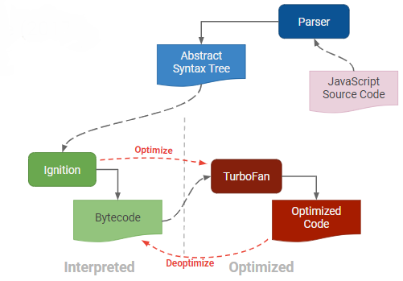

# Understanding How the Chrome V8 Engine Translates JavaScript into Machine Code
- Before diving deep into the core of Chrome’s V8, first, let’s get our fundamentals down.
- All of our systems consist of microprocessors, the thing that is sitting inside your computer right now and allowing you to read this.
- Microprocessors are tiny machines that work with electrical signals and ultimately do the job.
- We give microprocessors the instructions. The instructions are in the language that microprocessors can interpret.
- Different microprocessors speak different languages. Some of the most common are IA-32, x86–64, MIPS, and ARM.
- These languages directly interact with the hardware so the code written in them is called machine code.
- Code that we write on our computers is converted or compiled into machine code.
# What is the hig level languages ?
- High-level languages are abstracted from machine language.
- In the level of abstraction below, you can see how far JavaScript is abstracted from the machine level.
- C/C++ are relatively much closer to the hardware and hence much faster than other high-level languages.
# What is Chrome V8 engine ?
- V8 provides the runtime environment in which JavaScript executes
- The DOM, and the other Web Platform APIs are provided by the browser.
- The cool thing is that the JavaScript engine is independent of the browser in which it's hosted.
- This key feature enabled the rise of Node.js
-  V8 was chosen to be the engine that powered Node.js back in 2009, and as the popularity of Node.js exploded,
   V8 became the engine that now powers an incredible amount of server-side code written in JavaScript.
- V8 is Google's open-source engine written in C++ that compiles JavaScript to optimized machine code before execution.
- V8 engine is a powerful open source Javascript engine provided by Google.
- It is a program that converts Javascript code into lower level or machine code that microprocessors can understand.
- There are different JavaScript engines including Rhino, JavaScriptCore, and SpiderMonkey.
- These engines follow the ECMAScript Standards. ECMAScript defines the standard for the scripting language.
- JavaScript is based on ECMAScript standards.
- These standards define how the language should work and what features it should have.
- The V8 engine is written in C++ and used in Chrome and Nodejs.
- It implements ECMAScript as specified in ECMA-262.
- The V8 engine can run standalone we can embed it with our own C++ program.
# Compiler and Interpreter ?
- JavaScript is generally considered an interpreted language, but modern JavaScript engines no longer just interpret JavaScript, they compile it.
- As initial JavaScript engines were interpreters, they worked on the code line by line.
- With time, this was not good enough. The Chrome V8 implemented a technique called Just-In-Time (JIT) compilation.
- JavaScript is internally compiled by V8 with just-in-time (JIT) compilation to speed up the execution.
- This technique uses a mix of both interpreters and compilers to get better execution.
- Current all modern js engines make use of both compiler and interpreter to excute the code.
- A JavaScript engine can be implemented as a standard interpreter, or just-in-time compiler that compiles JavaScript to bytecode in some form.
- The first JavaScript engines were almost only interpreters, but most modern engines employ just-in-time (JIT) compilation for upgraded performance.
-  In this new world, compiling JavaScript makes perfect sense because while it might take a little bit more to have the JavaScript ready, once done it's going to be much more performant than purely interpreted code.
# What are the popular js engines ?
- Chrome’s V8 engine
- Firefox’s SpiderMonkey
- Safari’s JavaScriptCore (a.k.a Nitro, SquirrelFish and SquirrelFish Extreme)
- Edge’s Chakra — but Edge has recently embraced Chromium‘s V8 engine
# Flow diagram of Javascript engine

1. Parser ?
- Initially, the HTML parser would come across a script tag with a JavaScript source.
- The source code within this script will be loaded as a UTF-16 byte stream to the byte stream decoder.
- These bytes are decoded into tokens that are forwarded to the parser.
- The engine would always avoid parsing code that isn’t currently needed, to be more efficient.
2. AST ?
- The parser generates nodes that are based on the tokens it receives.
- With these nodes, the Abstract Syntax Tree (AST) is created.
- ASTs play a crucial role in the semantic analysis where the compiler validates the proper use of language elements and keywords.
3. Interpreter ?
- It analyzes through the AST and generates byte code.
- It interprets the code line by line.
- When the byte code is generated, the AST will be removed and the memory space will be cleared.
- The interpreter produces unoptimized machine code quickly and can start running without delay.
- The concern with interpreters is that executing the same function several times can get very slow,
  which is why we have a compiler that doesn’t repeat loops and is more streamlined.
4. Profiler ?
- The profiler assesses the code as it runs and recognizes areas where optimization techniques can be performed.
5. Compiler ?
- With the support of the profiler, any unoptimized code is passed to the compiler to perform enhancements and
  produce machine code that ultimately replaces its equivalent in the previously created unoptimized code by the interpreter.
6. Optimized code ?
- At the end of these 6 steps, you will receive a highly optimized code.
# Javascript Runtime environment ?

- Think of the JS runtime environment as a big container.
  Within the big container are other smaller containers.
  As the JS engine parses the code it starts putting pieces of it into different containers.
1. Heap ?
- The first container in the environment, which is also part of the V8 JS Engine, is called the ‘memory heap.’
- As the V8 JS Engine comes across variables and function declarations in the code it stores them in the Heap.
2. Stack ?
- The second container in the environment is called the ‘call stack.’
  It is also part of the V8 JS Engine. As the JS Engine comes across an actionable item, like a function call, it adds it to the Stack.
- Once a function is added to the Stack the JS engine jumps right in and starts parsing its code,
  adding variables to the Heap, adding new function calls to the top of the stack, or sending itself to the third container where Web API calls go.
- When a function returns a value, or is sent to the Web API container, it is popped off the stack and moves to the next function in the stack
- This process of parsing a function and popping it off the stack is what they mean when they say Javascript runs synchronously.
- It does one thing at a time on a single thread.
Note: the Stack is a data structure that runs LIFO — last in first out. No function other than the one at the top of the stack will ever be in focus, and the engine will not move to the next function unless the one above it is popped off.
3. The Web API Container ?
- The Web API calls that were sent to the Web API container from the Stack,
  like event listeners, HTTP/AJAX requests, or timing functions, sit in web api container until an action is triggered.
  Either a ‘click’ happens, or the HTTP request finishes getting its data from its source, or a timer reaches its set time.
  In each instance, once an action is triggered, a ‘callback function’ is sent to the fourth and final container, the ‘callback queue.’
4. The Callback Queue ?
- The Callback Queue will store all the callback functions in the order in which they were added.
  It will ‘wait’ until the Stack is completely empty.
  When the Stack is empty it will send the callback function at the beginning of the queue to the Stack.
  When the Stack is clear again, it will send over its next callback function.
Note: the Queue is a data structure that runs FIFO — first in first out. Whereas the Stack uses a push and pop (add to end take from end), the Queue uses push and shift (add to end take from beginning).
5. The Event Loop ?
- The Event Loop can be thought of as a ‘thing’ inside the javascript runtime environment.
- Its job is to constantly look at the Stack and the Queue.
- If it sees the Stack is empty, it will notify the Queue to send over its next callback function.
- The Queue and the Stack might be empty for a period of time, but the event loop never stops checking both.
  At any time a callback function can be added to the Queue after an action is triggered from the Web API container.
- This is what they mean when they say Javascript can run asynchronously.
- It isn’t actually true, it just seems true.
- Javascript can only ever execute one function at a time, whatever is at top of the stack, it is a synchronous language.
- But because the Web API container can forever add callbacks to the queue,
  and the queue can forever add those callbacks to the stack, we think of javascript as being asynchronous.
  This is really the great power of the language. Its ability to be synchronous, yet run in an asynchronous manner, like magic!
# What is Blocking vs Non-Blocking I/O ?
- When we talk about blocking I/O, think of an infinite loop, where a function just keeps running.
- If the function never stops running then it will never get popped off the stack, thus ‘blocking’ the next function in the stack from ever running.
- Another possibility is running a function that has so much complex logic and calculations,
  it thus takes so much time to run that it ‘blocks’ the next function from running.
  These are things to be aware of when creating code, but these are more programming errors and poorly written code that block i/o, rather than it being the fault of the language.
- One thing that can be a ‘blocking i/o’ is an HTTP request.
  Say you make a request to some external site data and you have to wait for that site’s network.
  The network may never respond and your code will ultimately be stuck.
- But Javascript handles this in the runtime environment.
- It sends the HTTP request to the Web API and pops it off the stack so that the next function can run while the Web API waits for its data to return.
- If the HTTP request never gets its data back the rest of the program will continue running.
- This is what we mean when we say JS is a Non-Blocking language.
