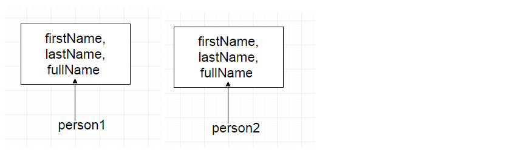
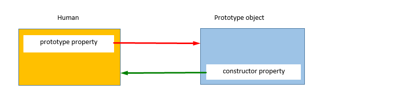
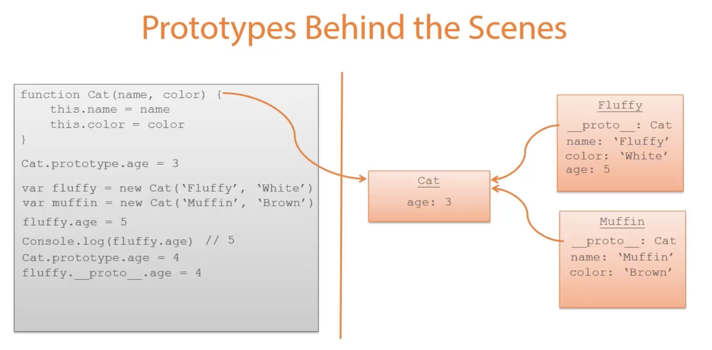
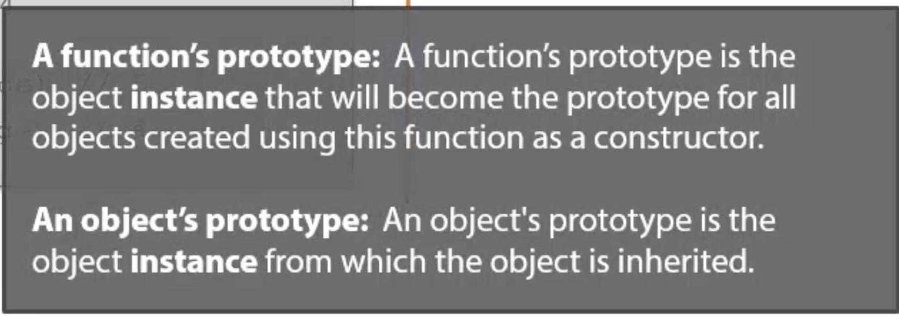
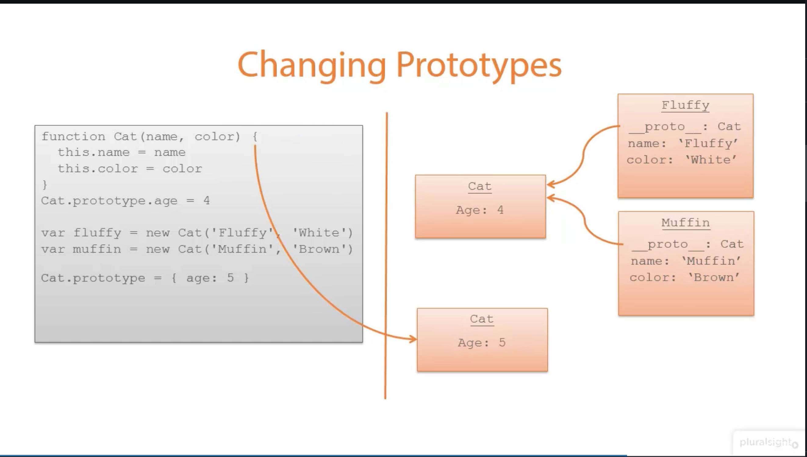

# Javascript Prototypes
- JavaScript is a prototype-based language, meaning object properties and methods can be shared through generalized objects
  that have the ability to be cloned and extended
- This is known as prototypical inheritance and differs from class inheritance
- Every object in JavaScript has an internal property called [[Prototype]]. We can demonstrate this by creating a new, empty object.
- To find the [[Prototype]] of this newly created object, we will use the getPrototypeOf() method.
# What is the problem in creating objects with constructor function ?
```
function Human(firstName, lastName) {
this.firstName = firstName,
this.lastName = lastName,
this.fullName = function() {
return this.firstName + " " + this.lastName;
}
}

var person1 = new Human("Virat", "Kohli");

console.log(person1)
```
Let’s create objects person1 and person2 using the Human constructor function:
```
var person1 = new Human("Virat", "Kohli");
var person2 = new Human("Sachin", "Tendulkar");
```
- On executing the above code, the JavaScript engine will create two copies of the constructor function, each for person1 and person2.

- Every object created using the constructor function will have its own copy of properties and methods.
- It doesn’t make sense to have two instances of function fullName that do the same thing.
- Storing separate instances of function for each object results in wastage of memory.
- We will see as we move forward, how we can solve this issue.
# What is Prototypes ?
- When a function is created in JavaScript, the JavaScript engine adds a "prototype" property to the function.
- This "prototype" property is an object (called a "prototype" object) that has a "constructor" property by default
- The constructor property points back to the function on which "prototype" object is a property.
- We can access the function’s "prototype" property using "functionName.prototype".

- As shown in the above image, Human constructor function has a prototype property that points to the prototype object.
- The prototype object has a constructor property that points back to the Human constructor function.
Let’s see an example below:
```
function Human(firstName, lastName) {
this.firstName = firstName,
this.lastName = lastName,
this.fullName = function() {
return this.firstName + " " + this.lastName;
}
}

var person1 = new Human("Virat", "Kohli");

console.log(person1)
```


# PluralSight
# What is Prototype ?
# A Function's prototype:
- A function's prototype is the object instance that will become the prototype for all objects created using this function as a constructor
# A Object's prototype:
- An object's prototype is the object instance from which object is inherited.
- Prototype is not like a class. It is actually object.
- When a function is created, it gets a prototype object created and attached to it behind the scenes.
- if that function is then used as a constructor function with the new keyword, the object that is created has a proto property
  that is pointing to the same object that is the function's prototype


# Changing a function's prototype ?

- When we changed the prototype of our function, what we really did was create a new object in memory and changed the function's prototype
  property to point at the new object.
- However the existing Fluffy and Muffin instances of our cat still have prototypes that are pointing to the old prototype object.
- When we then created our new Snowbell instance of a cat, it created a new object and sets its prototype to point to the current prototype of the Cat function
- This really highlights the fact that prototypes really are objects that live in memory. They behave like any other object with regards to pointers.
- By default, all objects in Javascript inherit from object. And object has no pprotypes.


# Pluralsight kyle
- Every single object is built by a constructor function
- a constructor makes an object linked to its own prototype
```
function Foo(who) {
this.me = who;
}
```
