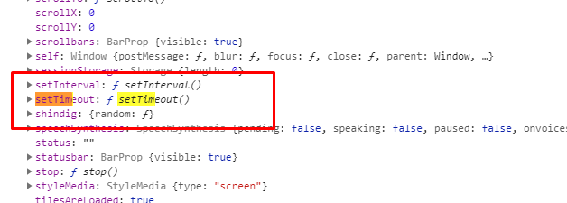
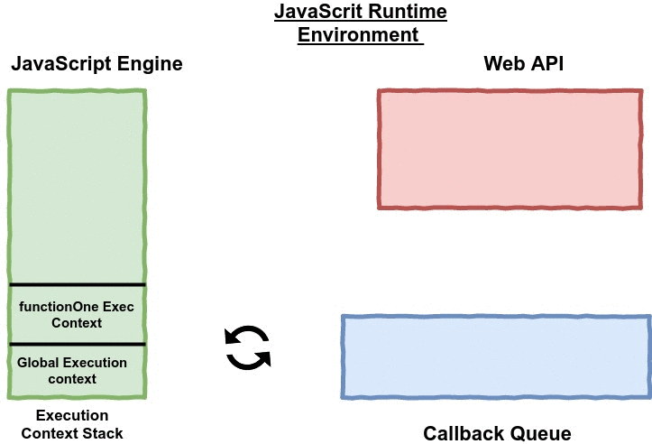

## What are setTimeout and SetInterval ?
- setTimeout and setInterval are called as timer functions in JavaScript.
- They are used to schedule the execution of functions.
- They are not provided by the JS engine itself but they are provided by browser as part of the window object.
- In Node, timers are part of the global object, which behaves similarly to the browser’s Window interface.
This is what the `window`object looks like:

- we can see that both timer functions setTimeout and setInterval are available on the window object
# What is the setTimeout function syntax
`setTimeout(callbackFunction, timeToDelay)`
- setTimeout accepts callback function and time in milliseconds as a parameter.
- callbackFunction gets executed after the timeToDelay milliseconds
# The callbackFunction gets executed after the timeToDelay. Is it correct ?
- this statement is somewhat incorrect.
Let's consider this example:
```
function printStatement() {
console.log("I will be printed after 100 milliseconds")
}

setTimeout(printStatement, 100)

/* ******* Alternate syntax ******************/
/*
setTimeout can be written as this also

setTimeout(fucntion(){
console.log("Hello")
}, 100)

*/
/* ******* Alternate syntax ******************/

console.log("I will be executed first")

/* Output:
I will be executed first
I will be printed after 100 milliseconds    // After 100 millieconds
*/
```
- even though printStatement function has to be executed after 100 milliseconds but
  JS engine will not wait for 100 milliseconds for its execution to start but
  will execute the next line i.e. console.log without any delay.
- Hence, the first statement to be printed is “I will be exected first” rather than “I will be printed after 100 milliseconds”
  though as per normal JS engine execution flow i.e. from top to bottom, “I will be printed after 100 milliseconds”
  should have printed first.
- This shows that "setTimeout" does not block the execution of the script.
# How to work timers in js run time environment ?
Consider the code example below:
```
var log = console.log

log("Inside global execution context")

function functionOne() {
log("Inside function one")

function setTimeoutFunction() {
log("Inside setTimeoutFunction: I will be executed atleast after 1 sec")
}

setTimeout(setTimeoutFunction, 1000)

for(var i = 0; i < 10000000000; i++) {
// Blocking code. This makes the for loop to execute for more than 1 second
// Still setTimeoutFunction is not executed. It gets executed only after
// last statement of the code
}

log("Exiting functionOne")
}

functionOne()

log("Exiting global execution context")
```

Let’s execute the above code line by line
- "Line 1": As soon as code loads in the browser, JS engine pushes the global execution context in the Execution Context Stack and starts executing the script.
- "Line 23": When functionOne is called, JS engine pushes functionOne execution context in the Execution Context Stack and starts executing functionOne
- "Line 12": When JS engine encounters setTimeout, it moves setTimoutFunction along with metadata i.e. 1000 ms to Web API container or the event table. setTimeoutFunction will stay in the web API container till 1000 ms. JS engine doesn’t wait for 1000 ms for the execution of setTimeout callback function, it continues executing the code after setTimeout function
- "Line 14": JS engines iterate over the for loop 10000000000 times. This takes more than 1000 ms. Meanwhile, in the Web API container, when 1000 ms completes setTimeoutFunction is moved from the Web API container to the callback queue or the message queue. JS engine is unaware of these things, it does not know where is setTimeoutFunction.
- During this period, the event loop continuously checks both the execution context stack and event loop. It checks two things:
1. If the execution context stack is empty
2. If there are any messages or events in the callback queue.

- If the event loop finds that the execution context stack is empty and there is a message in the callback queue,
it will move the associated method from callback queue to the execution context stack.
Once this method is moved to the execution context stack, the JS engine will begin its execution.
If there are multiple messages inside the callback queue, messages will be moved to the execution context stack one by one
in the order they were added in the queue (Remember callback queue is First In First Out)
- If the execution context stack is not empty, the event loop will not move the message from the callback queue to the execution context stack.
- While for loop is being executed by the JS engine, there are two execution contexts in the stack — functionOne execution context and global execution context.
  Hence, setTimeoutFunction though present in the event queue will not be moved to the execution context stack by the event loop.
- "Line 21": Execution of functionOne has been completed by the JS engine, so the execution context of functionOne will be removed from ECS.
   Now, in ECS we have global execution context. Even though 1000 milliseconds have passed, setTimeoutFunction will still remain in the callback queue as ECS is not empty.
* Thus, the time passed to setTimeout function does not guarantee its execution after the elapse of that time,
  but it is the minimum time after which setTimeout callback function will be executed.
- "Line 25": After the execution of this line, the global execution context will be removed from the execution context stack.
Now, when event loop checks execution context stack, it finds it is empty.
Also, when it checks if there is any message in the callback queue it finds setTimeoutFunction.
Both the condition to move the message from the callback queue to the execution context stack is satisfied hence,
the event loop will move the setTimeoutFunction from callback queue to the execution context stack.
As soon as setTimeoutFunction is moved to execution context stack, JS engine will begin its execution.
# Takeaways from the above example:
1. JavaScript is single thread i.e. at any instant of time it can execute only a single piece of code.
2. JS engine executes the function which is at the top of the stack
3. Asynchronous jobs like waiting for the setTimeout callback function to execute is not done by the JavaScript engine itself.
   It is done by the JavaScript run time environment
4. Web APIs are moved from the Web API container to the callback queue only when the required event has occurred.
   For example, setTimeout callback function is moved to callback queue only when the time passed in the setTimeout has elapsed.
# What is zero delay ?
- If you specify the timeout delay to 0, the callback function will be executed as soon as possible, but after the current function execution:
- This is especially useful to avoid blocking the CPU on intensive tasks and let other functions be executed while performing a heavy calculation, by queuing functions in the scheduler.
```
setTimeout(() => {
console.log('after ')
}, 0)

console.log(' before ')
```
Output: 'before' 'after'
Note: Some browsers (IE and Edge) implement a setImmediate() method that does this same exact functionality,
      but it’s not standard and unavailable on other browsers. But it’s a standard function in Node.js.
# What is the setInterval ?
- "setInterval" is a function similar to "setTimeout", with a difference: instead of running the callback function once, it will run it forever,
   at the specific time interval you specify (in milliseconds):
```
const interval = setInterval(() => {
if (App.somethingIWait === 'arrived') {
clearInterval(interval)
return
}
// otherwise do things
}, 100)
```
# What is Recursive setTimeout ?
setInterval starts a function every n milliseconds, without any consideration about when a function finished its execution.
- If a function takes always the same amount of time, it’s all fine:
- Maybe the function takes different execution times, depending on network conditions.
- And maybe one long execution overlaps the next one
- To avoid this, you can schedule a recursive setTimeout to be called when the callback function finishes:
```
const myFunction = () => {
// do something

setTimeout(myFunction, 1000)
}

setTimeout(
myFunction()
}, 1000)
```
# What is requestAnimationFrame ?
There used to be just one way to do a timed loop in JavaScript: setInterval().
If you needed to repeat something pretty fast (but not as-fast-as-absolutely-possible like a for loop) you’d use that.
For the purposes of animation, the goal is sixty “frames” per second to appear smooth, so you’d run a loop like this:
```
setInterval(function() {
// animiate something
}, 1000/60);
```
There is a better alternative to this now. Paul Irish introduced requestAnimationFrame over two years ago
- The browser can optimize it, so animations will be smoother
- Animations in inactive tabs will stop, allowing the CPU to chill
- More battery-friendly
```
function repeatOften() {
// Do whatever
requestAnimationFrame(repeatOften);
}
requestAnimationFrame(repeatOften);
```
- requestAnimationFrame returns an ID you can use to cancel it, just like setTimeout or setInterval does.
